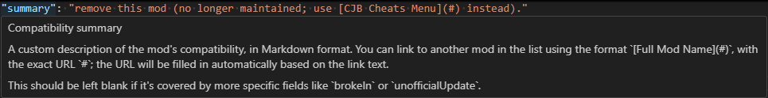

This repository has the compatibility metadata for every [Stardew Valley][] C# mod for [SMAPI][].
The [mod compatibility list][] is automatically generated from this data.

## For players
See the [mod compatibility list][] instead!

## Edit the compatibility list
Contributions are welcome!

### Guidelines
Before proposing changes, please be aware of these guidelines:

- **Don't add XNB mods.**  
  See [Modding:Using XNB mods][] on the wiki instead.
- **Don't add compatible content packs.**  
  This primarily lists C# SMAPI mods. However, broken content packs can still be listed in the
  `brokenContentPacks` field.
- **Don't mark most mods 'abandoned' or 'obsolete'.**  
  A mod is only considered 'abandoned' or 'obsolete' if (a) the mod author has explicitly abandoned
  the mod, or (b) they've hidden or deleted the mod page, or (c) it's been superseded by an
  equivalent game feature. A mod is not considered abandoned just because it hasn't been updated
  for a while.
- **Don't mark a mod 'broken' due to regular bugs.**  
  Only mark a mod 'broken' if it's incompatible. This isn't the place to track general mod bugs,
  unless they impact compatibility. In rare cases where a non-compatibility bug is severe enough to
  note here (e.g. game crashes on some platforms), you can use the `warnings` field.
- **All contributions are released under this [repo's open-source MIT license](LICENSE).**

### Propose changes
To update this list:

1. Navigate to `data/data.jsonc` in the GitHub web UI.
2. Click the "Edit this file" icon in the top-right corner.
3. Copy the text into a text editor like [Visual Studio Code][] that understands JSON schemas.
4. Make any changes needed.

   You can point at a field for an explanation of that field. For example:
   
5. Copy your changes back into the GitHub web UI, and click the big green button to propose the changes.

### Mod compatibility list
The public [mod compatibility list][] will be updated automatically within 10 minutes when a change
is merged.

[Modding:Using XNB mods]: https://stardewvalleywiki.com/Modding:Using_XNB_mods
[Submit a pull request]: https://docs.github.com/en/pull-requests/collaborating-with-pull-requests/proposing-changes-to-your-work-with-pull-requests/creating-a-pull-request

[mod compatibility list]: https://smapi.io/mods

[SMAPI]: https://github.com/Pathoschild/SMAPI
[Stardew Valley]: https://www.stardewvalley.net
[Visual Studio Code]: https://code.visualstudio.com/
